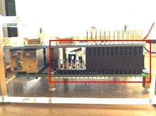
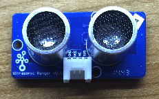
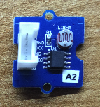
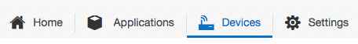
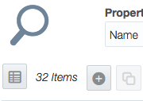
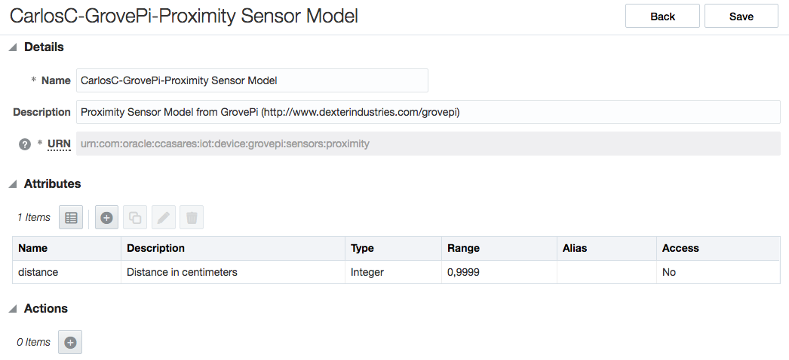
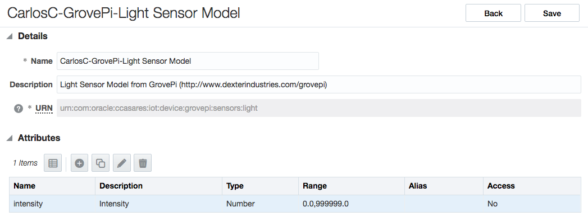

# grovepi-iotcs
Simple test of GrovePi Kit sending data to Oracle IoTCS
## Purpose
This is a simple node.js project that shows how to send data from devices connected through a GrovePi+ Kit for [Raspberry Pi](http://www.seeedstudio.com/item_detail.html?p_id=2572), to [Oracle Internet Of Things Cloud Service](https://cloud.oracle.com/iot). I'm obviously leveraging IoTCS's JavaScript Device Client Libraries.
## Disclamer
Follow my instructions at your own risk. Although everything related to the RPi, GrovePi+ board and devices is extremely simple and nothing should go wrong, be sure to read any additional information from the original manufacturers of Raspberry and GrovePi+ if you're not sure what you're doing.

I am not, and not pretend to be, an experienced programmer. So don't expect super-high-quality-and-production-ready code. As a Presales Consultant, for me it's enough if it works in a quick customer demo :grin:.
## My environment
I provide details about how to setup everything from scratch, assuming you will be using a similar environment:

* [Raspberry Pi 3](https://www.raspberrypi.org). Earlier models should work, but I'm omitting any setup related to WiFi or Bluetooth dongles, as the RPi3 has built-in support for those.
* [GrovePi+ Kit](http://www.dexterindustries.com/shop/grovepi-starter-kit-raspberry-pi/)
* [Raspbian For Robots image](http://www.dexterindustries.com/howto/install-raspbian-for-robots-image-on-an-sd-card/) installed in your SD card
 * There are instructions available about how to enable your own Raspbian image for GrovePi. Unfortunately, even after following those instructions, it didn't work for me. So I decided to use this pre-configured image from Dexter Industries which worked like a charm.
* For the demo, I've used the [Light Sensor](http://www.seeedstudio.com/wiki/Grove_-_Light_Sensor) and [Ultrasonic Ranger](http://www.seeedstudio.com/wiki/Grove_-_Ultrasonic_Ranger). GrovePi+ Kit comes with many other ones, and even more sensors are available and could be used for your own purposes. Just plug them in to the GrovePi board and use the right libraries to access them!
* Although both IoTCS and GrovePi+ support many different programming languages (Java, Python, C#...) I'm a JavaScript/NodeJS fan. And that's what you'll find in here :grin:.
 * I've used [nodejs](https://nodejs.org) 6.2.0 for development and testing. But I'm pretty sure this should work with earlier and newer versions of NodeJS. Just give it a try yourself.
* [Oracle Internet Of Things Cloud Service release 16.2.3](https://cloud.oracle.com/iot). The instructions you'll find here about IoTCS are for releases 16.1.3 or higher. Same for the Client libraries.
* [Oracle Process Cloud Service](https://cloud.oracle.com/process) release 16.1.3 or higher.
* [Oracle Integration Cloud Service](https://cloud.oracle.com/integration) release 16.2.3 or higher.
* Last, but certainly not least, make sure your RPi3 is connected to an Internet-enabled WiFi :smirk:

## Let's go for it!
### Raspberry Pi 3 & GrovePi+ Kit Setup

1. Get a microSD card (at least 4GB)
2. Download Raspbian for Robots image from [here](http://www.dexterindustries.com/howto/install-raspbian-for-robots-image-on-an-sd-card/). This page also contains detailed instructions about how to write the image to your microSD card.
3. Plug your GrovePi+ board in your RPi3. Make sure you do it properly. Have a look to the following picture:

   

4. Start your RPi3 and log in. The Raspian for Robots image already includes a nodejs. Unfortunately it's an old one and it's better to install a newer versions
    1. Download the latest version of NodeJS from [here](https://nodejs.org/en/download/current/). Make sure you download the **ARMv6** platform.
    2. Uninstall the previous NodeJS and install (unzip) the new one. I installed it in `$HOME/nodejs` folder.
    3. Remove any existing `node` and `npm` existing soft links in `/usr/local/bin` folder.
    4. Create soft links for both `node` and `npm` in `/usr/local/bin` folder, pointing to your NodeJS installation.

       ```bash
    $ cd /usr/local/bin
    $ sudo ln -s $HOME/nodejs/bin/node .
    $ sudo ln -s $HOME/nodejs/bin/npm .
    ```
    5. Install `node-forge` package, globally

       ```bash
    $ sudo npm install -g node-forge
    ```
    6. Update your environment to include `NODE_PATH=$HOME/nodejs/lib/node_modules` environment variable

       ```bash
    $ cd $HOME
    $ vi .profile
    (add export NODE_PATH=$HOME/nodejs/lib/node_modules line at the end)
    $ . ./.profile
    ```

5. The Raspian for Robots image includes libraries and samples for many GrovePi sensors and programming languages. You can find those in your Desktop folder
    ```bash
    pi@raspberrypi3:~/Desktop/GrovePi $ ls -l
    total 136
    drwxr-xr-x  3 pi pi   4096 Jun  1 11:39 Firmware
    -rw-r--r--  1 pi pi 100572 Jun  1 11:39 GrovePi_Plus_By_Dexter_Industries_For_the_Raspberry_Pi.JPG
    drwxr-xr-x  2 pi pi   4096 Jun  1 11:39 Hardware
    -rwxr-xr-x  1 pi pi   1201 Jun  1 11:39 LICENSE
    drwxr-xr-x 21 pi pi   4096 Jun  1 11:39 Projects
    -rwxr-xr-x  1 pi pi   4200 Jun  1 11:39 README.md
    drwxr-xr-x  5 pi pi   4096 Jun  1 13:24 Script
    drwxr-xr-x  9 pi pi   4096 Jun  1 11:39 Software
    drwxr-xr-x  2 pi pi   4096 Jun  2 01:29 Troubleshooting
    ```
    ```bash
    pi@raspberrypi3:~/GrovePi/Software $ ls -l
    total 32
    drwxr-xr-x  2 pi pi 4096 Jun  1 11:39 C
    drwxr-xr-x  5 pi pi 4096 Jun  1 11:39 CSharp
    drwxr-xr-x  3 pi pi 4096 Jun  1 11:39 Go
    drwxr-xr-x  4 pi pi 4096 Jun  1 11:39 NodeJS
    drwxr-xr-x 23 pi pi 4096 Jul  6 23:19 Python
    -rwxr-xr-x  1 pi pi 1445 Jun  1 11:39 README.md
    drwxr-xr-x  4 pi pi 4096 Jun  1 11:39 Scratch
    drwxr-xr-x  4 pi pi 4096 Jun  1 11:39 Shell
    ```
as noted above, I've used NodeJS stuff. However, it's a good idea to use the Python individual samples to test each sensor. More on this next.

6. Now, let's test our Light Sensor and Ultrasonic Ranger devices before going further with my sample. Make sure you take the right sensors :wink::

    
    

7. Plug each of them in the right ports. It is important to note that there are some sensors that produce analog signals, and others produce digital signals. Thus, the GrovePi+ board contains 3 input ports for analog sensors (numbered as A0, A1 and A2), and 7 input ports for digital sensors (numbered as D2, D3, D4, D5, D6, D7 and D8). You can localize them in the next diagram:

    

    The Light Sensor produces analog signals, so you must plug it in in any of the Analog Ports (A0, A1 or A2). The Ultrasonic Ranger sensor produces digital signals, so plug it in, in any of the Digital Ports (D2, D3, D4, D5, D6, D7 or D8). Just **take note of the port used**.

    In my case, I've plugged them in using the **A2** and **D4** ports.

8. Once plugged in, go to the Python samples directory

    ```bash
    pi@raspberrypi3:~ $ cd $HOME/Desktop/GrovePi/Software/Python
    pi@raspberrypi3:~/Desktop/GrovePi/Software/Python $ ls -l grove_ultrasonic.py grove_light_sensor.py
    -rw-r--r-- 1 pi pi 2674 Jun  1 11:39 grove_light_sensor.py
    -rw-r--r-- 1 pi pi 1941 Jun  1 11:39 grove_ultrasonic.py
    ```
Edit both files and make sure you set the port number you're using in your case.
    For the `grove_light_sensor.py` file:

    ```python
    ...
    # Connect the Grove Light Sensor to analog port A0
    # SIG,NC,VCC,GND
    light_sensor = 0
    ...
    ```
Change the `0` to your port (if necessary).

    For the `grove_ultrasonic.py` file:

    ```python
    ...
    # Connect the Grove Ultrasonic Ranger to digital port D2
    # SIG,NC,VCC,GND
    ultrasonic_ranger = 2
    ...
    ```
Change the `2` to your port (if necessary).

    Now, start the `grove_light_sensor.py` test sample and check the results. Cover the sensor with your finger or palm and see what happens:

    ```bash
pi@raspberrypi3:~/Desktop/GrovePi/Software/Python $ python grove_light_sensor.py
sensor_value = 759 resistance =3.48
sensor_value = 757 resistance =3.51
sensor_value = 438 resistance =13.36
sensor_value = 376 resistance =17.21
sensor_value = 381 resistance =16.85
sensor_value = 16 resistance =629.38
```
    Do the same with the `grove_ultrasonic.py` test sample. Move your palm over the sensor to see how it measures the distance in centimeters:

    ```bash
pi@raspberrypi3:~/Desktop/GrovePi/Software/Python $ python grove_ultrasonic.py
61
61
266
267
16
3
```

    Cool, isn't it? :grimacing:. Sensors are working like a charm. Now, let's move on and send the data to Oracle IoTCS.

### Oracle IoTCS setup (Server side) (1)
#### Get your Instance
You will need to purchase an instance of Oracle IoTCS or request a trial account. I have been using a shared instance used by many Sales Consultants in Oracle around the world. Visit https://cloud.oracle.com/iot to get more info.
#### Create the Device Models
In IoTCS, a device model is a single entity that represents the interface through which Oracle IoT Cloud Service can interact with a specific device type.
The first step is to define the device models we're going to use in this sample. Say, the "Light Sensor" device model and the "Ultrasonic Ranger" device model.

1. Login to your IoTCS instance and click the `Devices`tab

   
2. Click the `+` button to create a new device model

   
3. In my sample I created my device model with the following data:
    1. Details:
        ```
    Name: CarlosC-GrovePi-Proximity Sensor Model
    Description: Proximity Sensor Model from GrovePi (http://www.dexterindustries.com/grovepi)
    URN: urn:com:oracle:ccasares:iot:device:grovepi:sensors:proximity
    ```

        The `URN`(_Uniform Resource Name_) is like a namespace in XML. It uniquely defines the device model in the IoTCS infrastructure. **Make sure you use the same URN as above**. You might use your own, but then you'll need to change it accordingly in your code. See more about URNs [here](https://en.wikipedia.org/wiki/Uniform_Resource_Name)

    2. Attributes:

        Click the `+` button to create a new attribute with the following details:

       ```
    Name: distance
    Description: Distance in centimeters
    Type: Integer
    Range: From 0 to 9999
    ```

4. Repeat the same steps for the "Light Sensor" model, with the following data:

    1. Details:
        ```
    Name: CarlosC-GrovePi-Light Sensor Model
    Description: Light Sensor Model from GrovePi (http://www.dexterindustries.com/grovepi)
    URN: urn:com:oracle:ccasares:iot:device:grovepi:sensors:light
    ```

    2. Attributes:

        ```
    Name: intensity
    Description: Intensity
    Type: Number
    Range: From 0.0 to 999999.0
    ```

Once done, you should have your two models registered as follows:



and



#### Register virtual devices
You must first register each device with Oracle IoT Cloud Service before the device can communicate and send any data to Oracle IoT Cloud Service.
Actual devices are _virtualized_ in IoTCS infrastructure. We will be using _Directly Connected Device_  in our sample. See IoTCS [documentation](https://docs.oracle.com/cloud/latest/iot/IOTGS/GUID-0AFFC157-E54C-4CE5-BB98-ED887C3977E7.htm) about device types.
One _virtualized device_ can be associated with one or more _device models_. Nonetheless, we will create one virtualized device per _actual device_.

1. While in the `Devices` tab, click on the `Register` icon on the left, and `Register Single Device` button.
2. Enter a meaningful `Name`, `Manufacturer`, `Serial Number` and `Model Number` values. Type in also the `Shared Secret` (or _password_) for this device. **Remember this shared secret** as it will be used later. Click `Register`.
3. Take note of the **`Device ID`** automatically generated.

### Oracle IoTCS setup (Client side)
#### Clone this repo
Official and supported IoTCS Client libraries are available in this [page](http://www.oracle.com/technetwork/indexes/downloads/iot-client-libraries-2705514.html). However, we're going to use a newer version which hasn't yet be released at the time I wrote this tutorial. This is because it contains some fixes that we'll take advantage of. You can find it in this repo <a href="iotcs-csl-js-bin-16.2.3.1.1-14.zip">here</a>. To ease things, we will clone this repo so that you'll get all files you need for this tutorial.

1. Login to RPi3 and create the `$HOME/projects` folder.
2. Move into `$HOME/projects` folder and clone this repo

   ```bash
   $ cd $HOME/projects
   $ git clone https://github.com/ccasares/grovepi-iotcs
   ```

3. Unzip the client library ZIP file into the `..` folder and you can then safely remove the `iotcs-csl-js-bin-16.2.3.1.1-14.zip` file
   ```bash
   unzip iotcs-csl-js-bin-16.2.3.1.1-14.zip -d ..
   ```

4. Finally let's create a soft link to the JS library in our project folder
   ```bash
   ln -s ../iot/csl/js/modules/device-library.node.js .
   ```
   This is not strictly necessary, but to avoid to write the whole path to the JS library in my code :wink:

#### Create the trust-store files
This version of the IoTCS JS libraries work with _Trusted assets_ which are defined as material that contribute to the chain of trust between the client and the server. The client library relies on an implementation of the TrustedAssetsManager to securely manage these assets on the client. The client-library has a default implementation of the TrustedAssetsManager which uses a framework native trust-store to secure the trust assets.

We need to create a trust-store (as a JSON file) to have access to each and every virtual device registered in the IoTCS platform ([See here](#register-virtual-devices)). How?, easy, just follow these steps:

1. Go to the `$HOME/iot/csl/js/bin` folder
2. Run the `provisioner.sh` script with:

   ```bash
   $ bash provisioner.sh
   ```
   **Do not** attempt to run it with `sh` or by making it executable with `chmod +x provisioner.sh`. Running the script with `sh` shell will fail, as it relies to the `{OSTYPE}` environment variable, which doesn't seem to be available within `sh` shell in this Raspbian image.
3. Type in the input parameters as follows:

   ```
   Enter Cloud Service URI: https://<your IoTCS instance hostname> (no need to include any context root, just the hostname using the HTTPS protocol)
   Enter the ID: <the virtual device ID obtained when registered earlier. I.e: AAAAAAQXFMEA-XX>
   Enter the shared secret: <the shared secret used when registering the virtual device>
   Enter the passphrase: <a passphrase that will encrypt the generated file. If you use my code 'as-is', enter welcome1 here>
   ```
   Repeat the above procedure for both virtual devices created.

4. This procedure will have generated two JSON files named `<device id>.json`. Do remember which file/ID is for which device. Move them to the `$HOME/projects/grovepi-iotcs` folder.

### Build your client sample / analize sample
I have written a very simple sample that will watch incoming data from the two actual sensors and will send it in real-time to the IoTCS instance.

You can write your own code form scratch or based on mine. Next, I will highlight certain key parts of the code.

My code consists in two files:

* `device.js` which represents a simple _device_ class with some attributes and their getters and setters. The idea for this class was to keep all setup information and classes to interact with a virtual device in IoTCS.
* `grovepi_iotcs.js` which is the main code. As a summary, this code performs the following tasks:
 * Setup and instantiate the IoTCS communication and virtual devices
 * Setup and initialize the GrovePi board and actual devices
 * Watch the devices and, as new data comes in, send it to its virtual device instance in IoTCS.

I decided to perform the above operations synchronously, that is, initialize IoTCS communication _before_ setting up GrovePi. And watch the devices _after_ the initialization procedures end. Some operations might have been performed concurrently, but anyhow I wanted to do everything in serial. Thus, I've heavily used the `async` NodeJS package (more [here](http://caolan.github.io/async)) because NodeJS is fully asynchronous. These are the key parts of my code:

  ```javascript
  var proximity = new Device('Proximity Sensor');
  var light = new Device('Light Sensor');
  ```
  > I instantiate one `Device` class per device. All IoTCS setting and classes used for the device will be stored and used from this `Device` class

  ```javascript
  proximity.setStoreFile(process.argv[2], storePassword);
  proximity.setUrn('urn:com:oracle:ccasares:iot:device:grovepi:sensors:proximity');
  light.setStoreFile(process.argv[3], storePassword);
  light.setUrn('urn:com:oracle:ccasares:iot:device:grovepi:sensors:light');
  ```
  > Setting the device URN and trust-store password is key as that's the way for IoTCS to uniquely identify the virtual device

  ```javascript
  async.series( {
    iot: function(callback) {
  ```
  > First `async` used. I will first initialize IoTCS and then the GrovePi board

  ```javascript
  async.eachSeries( devices, function(d, cb) {
  ```
  > I iterate over the `devices` array, initializing each device contained on it. This way, I could easily add new devices with very few new code

  ```javascript
  async.series( [
    function(cb1) {
  [...]
      d.setIotDcd(new dcl.device.DirectlyConnectedDevice(d.getIotStoreFile(), d.getIotStorePassword()));
  [...]
    },
    function(cb2) {
      if (!d.getIotDcd().isActivated()) {
  [...]
        d.getIotDcd().activate([d.getUrn()], function (device, error) {
  [...]
          d.setIotDcd(device);
        });
  [...]
    },
    function(cb3) {
  [...]
      getModel(d.getIotDcd(), d.getUrn(), (function (error, model) {
  [...]
          d.setIotModel(model);
          d.setIotVd(d.getIotDcd().createVirtualDevice(d.getIotDcd().getEndpointId(), model));
          log.verbose(IOTCS, "'" + d.getName() + "' intialized successfully");
  [...]
  ```

  ```javascript
  function getModel(device, urn, callback) {
    device.getDeviceModel(urn, function (response, error) {
      if (error) {
        callback(error);
      }
      callback(null, response);
    });
  }
  ```
  > I follow the next steps when initializing a device:
  >
  > 1. Create an instance of the `DirectlyConnectedDevice` object, providing the trust-store file and password
  > 2. Check whether the device is already activated. If not, I request its activation
  > 3. With the activated device, get its model definition and create an instance of the `Virtual Device` object, which is the one that will be used at the end to send data

  ```javascript
  grovepi: function(callback) {
  [...]
    board = new GrovePi.board({
  [...]
  ```
  > Create a new instance of the GrovePi `board`

  ```javascript
  var ultrasonicSensor = new GrovePi.sensors.UltrasonicDigital(4);
  var lightSensor = new GrovePi.sensors.LightAnalog(2);
  ```
  > Create the instances of each device. Please, note the port numbers used (either analog or digital). These must correspond to those used in the actual board

  ```javascript
  ultrasonicSensor.on('change', function(res) {
    if (typeof res === 'number') {
      proximity.getIotVd().update({ distance: res});
    } else {
      log.warn(GROVEPI, "Proximity Sensor: Invalid value read: " + res);
    }
  })
  ultrasonicSensor.watch();
  ```
  > Every time the sensor produces data, the `change` event is emitted and `on('change')` callback is called. In such callback, I first check the incoming value (sometimes garbage is received and I must ensure that a valid value is sent to IoTCS) and then _publish_ the data to the right IoTCS virtual device. The JSON structure sent corresponds to the attributes expected for such device model. The IoTCS Client libraries makes this very easy and straightforward to do!
  >
  > The device is not watched until we invoke the `device.watch()` method.
  >
  > Code for the _Light Sensor_ is similar to this one.

### Oracle IoTCS setup (Server side) (2)
#### Create and setup your application
In IoTCS, an IoT _application_ is a set of Oracle IoT Cloud Service definitions that comprise an end-to-end IoT solution. An Application contains the following:
* A mandatory unique name and description
* Optional metadata
* One or more Device Models associated
* Zero or more Explorations
 * An _Exploration_ allows you to process and analyze data messages that are sent from your devices to Oracle IoT Cloud Service
* Zero or more Integrations
 * An _Integration_ is the way to _send_ the incoming data (either processed by an Exploration or _raw_ data as it's received in IoTCS) to external third party applications.

##### Create your application
To create your application simply click in the `Applications` tab and the `Create Application` button. Provide a unique name and a description.

Once it's created, we'll go through the setup. First, we need to register which devices models are related to the new Application.

##### Register your device models
Click on `Device Model` button on the left. You can create new devices from here, but let's associate the two devices we created before.
Click the _hand_ icon


and, from the list, select the `Proximity Sensor` and `Light Sensor` devices.

##### Create your explorations
### Build your Process in Oracle Process Cloud Service
#### Get your Instance
You will need to purchase an instance of Oracle Process Cloud Service (PCS) or request a trial account. I have been using a shared instance used by many Sales Consultants in Oracle around the world. Visit https://cloud.oracle.com/process to get more info.
#### Create your process application
### Create your integration in Oracle Integration Cloud Service
#### Get your Instance
You will need to purchase an instance of Oracle Integration Cloud Service (PCS) or request a trial account. I have been using a shared instance used by many Sales Consultants in Oracle around the world. Visit https://cloud.oracle.com/integration to get more info.
#### Create your integration
### Oracle IoTCS setup (Server side) (3)
#### Create and setup your application (2)
##### Create the enterprise application integration
### Run the sample end2end!
